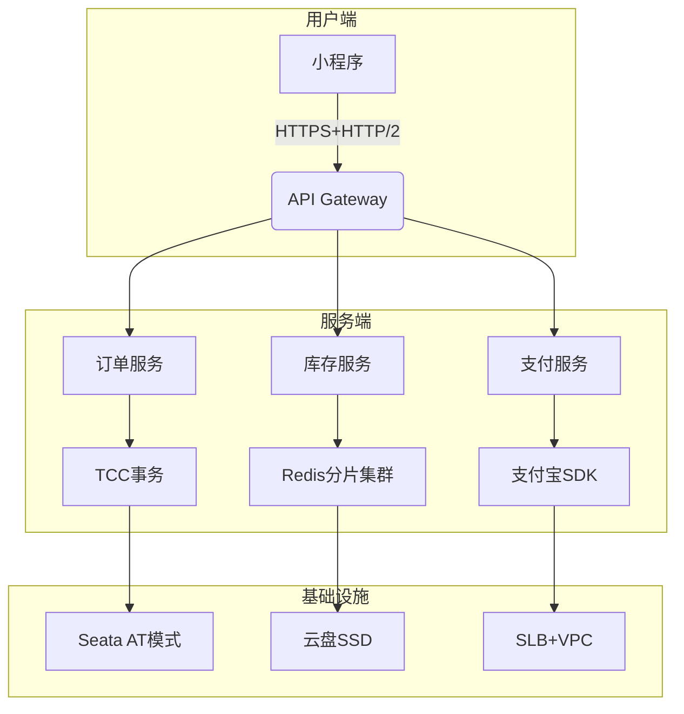
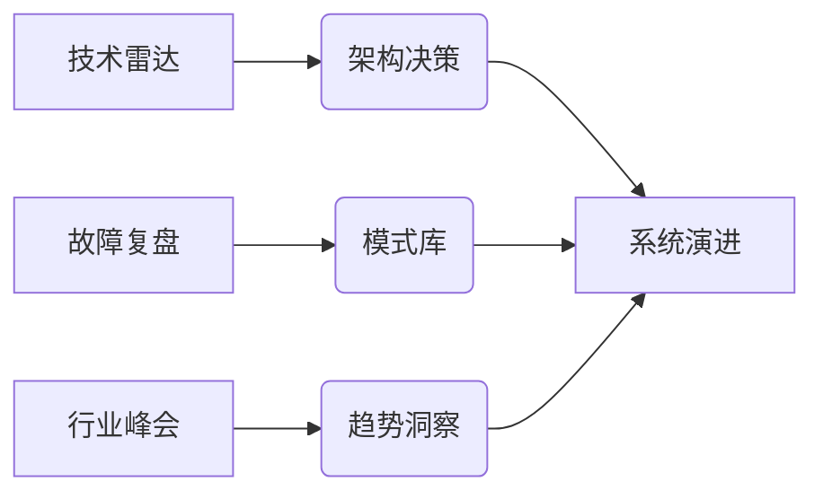

# 🏗️ 架构师视界 / [你的名字] 

<div align="center">
  
  
  
</div>

---

## 🎯 架构方法论
### 📐 设计原则

1. 可观测性优先：OpenTelemetry全链路埋点
2. 混沌工程实践：ChaosBlade故障注入
3. 成本敏感设计：Spot Instance弹性调度
4. 演进式架构：Strangler Fig模式应用

### 🛠️ 工具链选择

| 场景           | 技术选型                | 决策依据                 |
|----------------|-------------------------|--------------------------|
| 服务网格       | Istio + ACM             | 多集群管理能力           |
| 配置中心       | Nacos                   | 灰度发布支持             |
| 流量治理       | Sentinel                | 熔断降级策略可视化       |


---

## 🌐 代表性架构
### 🚢 电商交易系统重构



#### 核心设计亮点：
1. **分层降级策略**：核心交易链路与非关键服务隔离
2. **混合存储方案**：TiDB HTAP支撑实时数据分析
3. **混沌工程体系**：Chaos Mesh故障注入覆盖率达85%
4. **成本优化**：Spot Instance使用率提升至68%

---

## 🧩 系统设计工具箱
### 📊 架构决策树

当面临海量请求时：
1. 是否允许最终一致性？ 
   → 是：采用Event Sourcing模式
   → 否：使用分布式锁+排队机制

2. 数据增长模式？
   → 写多读少：LSM-Tree存储引擎
   → 读多写少：B+Tree索引优化

3. 团队技术栈？
   → Go系：Go-kit微服务框架
   → Java系：Spring Cloud Alibaba


### 🛠️ 实战模式库
```go
// 示例：优雅关机模式
func main() {
    server := &http.Server{Addr: ":8080"}
    
    // 信号捕获
    quit := make(chan os.Signal, 1)
    signal.Notify(quit, syscall.SIGINT, syscall.SIGTERM)
    
    // 并发处理
    go func() {
        if err := server.ListenAndServe(); err != nil {
            log.Fatal(err)
        }
    }()
    
    // 优雅退出
    <-quit
    ctx, cancel := context.WithTimeout(context.Background(), 5*time.Second)
    defer cancel()
    server.Shutdown(ctx)
}
```

---

## 📈 价值交付指标
### 🏆 架构优化成果

| 指标           | 优化前 | 优化后 | 实现手段                  |
|----------------|--------|--------|---------------------------|
| API成功率      | 92%    | 99.99% | 熔断降级+自动扩容         |
| P99延迟        | 850ms  | 120ms  | 异步化+边缘节点缓存       |
| 资源利用率     | 40%    | 78%    | 混合部署+资源隔离         |
| 部署频率       | 手动   | 每日50+次 | GitOps+ArgoCD           |

### 📊 成本收益分析

技术投入： 
- 自研服务网格：3人月
- 混沌工程平台：2人月

收益产出：
- 故障恢复时间 ↓ 70%
- 资源浪费 ↓ 45%
- 版本发布事故 ↓ 90%

---

## 🤝 架构师协作模式

### 🔄 设计评审清单

- ✅ 可扩展性验证：支持3倍流量增长
- ✅ 故障模式分析：至少3种容灾路径
- ✅ 监控埋点：关键路径100%覆盖
- ✅ 技术债管理：明确延期项影响范围

---

## 🛠️ 架构师装备库

### 🧰 生产环境调试套件
```bash
# 流量镜像示例
tc qdisc add dev eth0 handle ffff: ingress
tc filter add dev eth0 parent ffff: protocol ip u32 match u32 0 0 action mirred egress mirror dev eth1

# 实时链路追踪
go tool trace -http=:8080 trace.out
```

### 📚 知识管理方法


